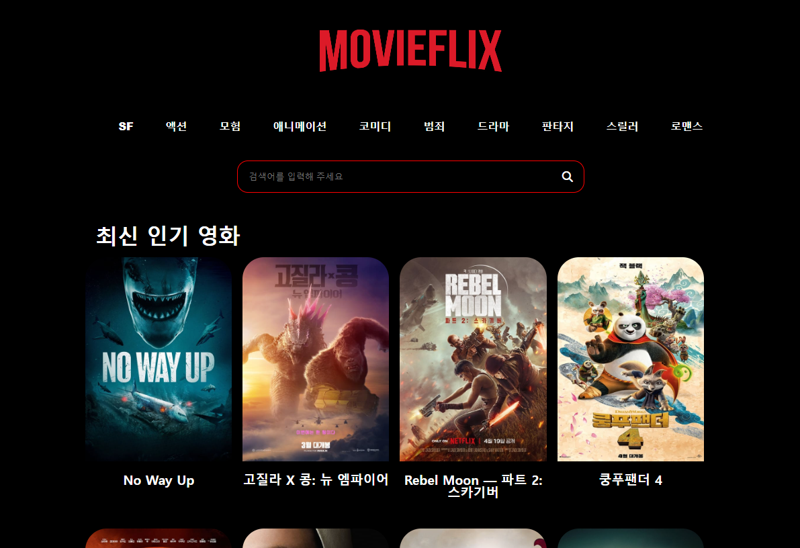

# movieflix

## 프로젝트 소개

이 프로젝트는 영화 정보를 제공하는 사이트로, 사용자에게 최신 영화 리스트를 제공하고 선택한 영화에 대한 상세 정보 및 출연진 정보를 보여줍니다. 또한 사용자는 장르별로 영화를 검색하거나 키워드를 사용하여 영화를 검색할 수 있습니다.

## 주요기능

- 최신 영화 리스트 제공: 사용자에게 최신 영화 목록을 보여줍니다.
- 영화 상세 정보 표시: 사용자가 영화를 클릭하면 해당 영화의 상세 정보와 출연진 정보를 표시합니다.
- 장르별 영화 검색: 사용자는 특정 장르의 영화 목록을 검색할 수 있습니다.
- 키워드로 영화 검색: 사용자는 특정 키워드를 사용하여 영화를 검색할 수 있습니다.

## 이슈 및 처리 방법

API 연동 문제: 외부 API를 사용하여 영화 데이터를 가져오는 동안 API 연동 문제가 발생했습니다. 이를 해결하기 위해 API 요청을 적절히 관리하고, 오류 처리를 추가하여 사용자에게 정확한 데이터를 제공하도록 했습니다.
반응형 디자인 문제: 다양한 화면 크기와 디바이스에서 웹 애플리케이션이 제대로 작동하지 않는 문제가 있었습니다. 이를 해결하기 위해 CSS 미디어 쿼리를 사용하여 반응형 디자인을 구현하고, 레이아웃을 조정하여 모바일 및 데스크톱 환경에서 모두 잘 작동하도록 했습니다.

## 사용한 API

[The Movie Database (TMDb)](https://www.themoviedb.org/?language=ko) API: 최신 영화 정보 및 출연진 정보를 제공하는 외부 API입니다. 영화 목록, 상세 정보, 출연진 정보를 가져오는 데 사용됩니다.

## 개선 목표

추가 기능 구현: 사용자 편의성을 높이기 위해 추가 기능을 구현하여 사용자 경험을 향상시킬 계획입니다. 예를 들어, 영화 리뷰 기능, 영화 추천 기능 등을 추가할 수 있습니다.
